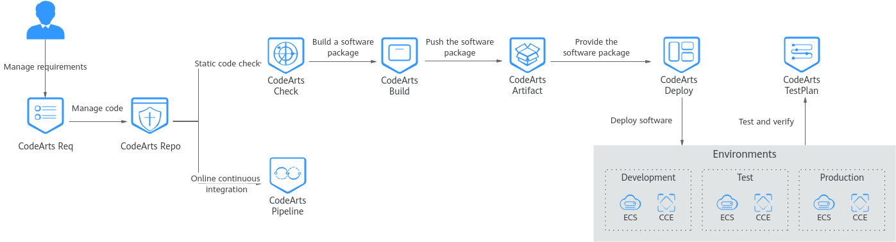

# Beginner's Handbook to enhance your knowledge on Huawei CodeArts Service

**Continuous Integration (CI)** and **Continuous Deployment (CD)** are crucial practices in modern software development. They streamline the process of building, testing, and deploying software, enhancing development efficiency and software quality. Below give you a brief explanation on the difference of Continuous Integration and Continuous Deployment.

* **Continuous Integration (CI)**: CI is the practice of frequently and automatically integrating code changes from developers into a shared repository. The developers will regularly commit their code changes to a central repository where this action will trigger the CI pipelines to perform builds, compile code, and run automated tests whenever changes and pushed. It aims to detect integration issues, bugs and conflicts early in the development process.
* **Continuous Deployment (CD)**: CD takes the CI process a step further by automating the deployment of code changes to various environments, including production, staging and testing. CD pipleine manages the deployments and responsible in ensuring the application release process is efficient and reliable and at the same time reducing manual intervention and deployment errors. 

In terms of application development and deployment in cloud environment, Huawei Cloud offer a one stop DevSecOps platform [Huawei CodeArts Service](https://support.huaweicloud.com/intl/en-us/productdesc-devcloud/devcloud_pdtd_00001.html) that could meet the requirements of delivery, code commit, check, build, verification, deployment, and release throughout the entire software lifecycle. Below describe the features offered in Huawei CodeArts Service.

*
  
*

*
 Figure 1.0: Huawei CodeArts Service Features 
*

* [**CodeArts Req**](https://support.huaweicloud.com/intl/en-us/productdesc-projectman/devcloud_pdtd_10001.html): This feature is used for project management purpose and facilitate the collaboration of the software development team. It allows you to plan your requirements, perform task assignment, track the project status and enable knowledge sharing.
* [**CodeArts Repo**](https://support.huaweicloud.com/intl/en-us/productdesc-codeartsrepo/codeartsrepo_01_0002.html): Is a Git-based online code hosting service that enables you to version your code, enable branch protection to avoid conflict in code changes and supports security control.
* [**CodeArts Check**](https://support.huaweicloud.com/intl/en-us/productdesc-codecheck/devcloud_pdtd_30001.html): Provide a code scan feature to detect the syntax error if any based on the pre-defined rules in the knowledge base. 
* [**CodeArts Build**](https://support.huaweicloud.com/intl/en-us/productdesc-codeci/cloudbuild_07_0001.html): Enable the conversion of source code into specific file format and package the configuration and resource file. Provides container-based build environments and works together with Huawei [Software Repository Warehouse (SWR)](https://support.huaweicloud.com/intl/en-us/productdesc-swr/swr_03_0001.html) service to host the container image generated.
* [**CodeArts Deploy**](https://support.huaweicloud.com/intl/en-us/productdesc-deployman/deployman_pdtd_00001.html): Provides a wide range of functions that support the automatic deployment to various environments. It includes the deployment to mutiple hosts, kubernetes, microservices and etc.
* [**CodeArts Pipeline**](https://support.huaweicloud.com/intl/en-us/productdesc-pipeline/pipeline_pdtd_00001.html): Provides visualized CI and CD pipelines that can be orchestrated and allows you to customize the pipeline tasks based on business requirements.
* [**CodeArts Artifacts**](https://support.huaweicloud.com/intl/en-us/productdesc-cloudartifact/cloudartifact_07_0001.html): Is a feature that helps to manage the software package that is generated during the software development. Generally provising two types of repositories which is release repo and self-hosted repo.
* [**CodeArts TestPlan**](https://support.huaweicloud.com/intl/en-us/productdesc-testman/devcloud_pdtd_50001.html): Is test management platform that covers the entire process of test plan, test design, test cases, test execution and test evaluation.

