# Getting Started to hands-on learning on Huawei CodeArts service
 
### Set up the project and repository

This section will guide you step by step to set up the project and repository in Huawei CodeArts service. It involves creating a new project and import the source code template from a public repository provided into the CodeArts Repo and configuring the SSH keys in the repository for you to commit source code from the local machine.

1. Log in to the [Huawei Cloud](https://auth.huaweicloud.com/authui/login.html?locale=en-us&service=https%3A%2F%2Fwww.huaweicloud.com%2Fintl%2Fen-us%2F#/login) account with the credentials configured or provided by your administrator. Navigate to the Huawei CodeArts management console and create a new project using the **Scrum** template.

    *<p align="center"> 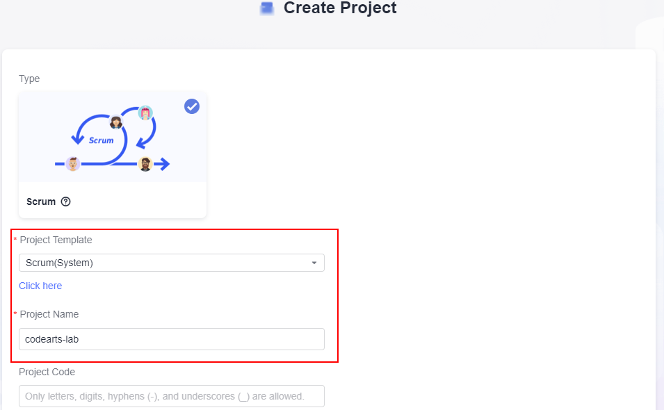 </p>*

    *<p align="center"> Figure 3.0: Create CodeArts Project </p>*

2. Import the source code template from a **public repository provided to the CodeArts Repo**. Navigate to the CodeArts Repo management console and import the repository by specifying the source repository URL as below. You may modify the repository name to be stored under your project repo.

    **GitHub Repo**: ```https://github.com/Huawei-APAC-Professional-Services/hwcloud-codearts-workshop.git```

    *<p align="center"> 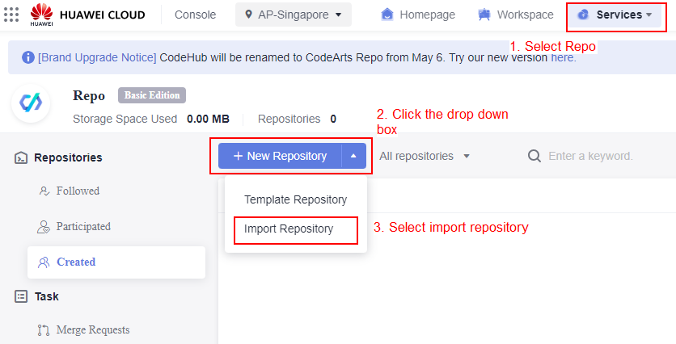 </p>*
    *<p align="center"> Figure 3.1: Import Source Code Template into CodeArts Repo </p>*
    *<p align="center"> 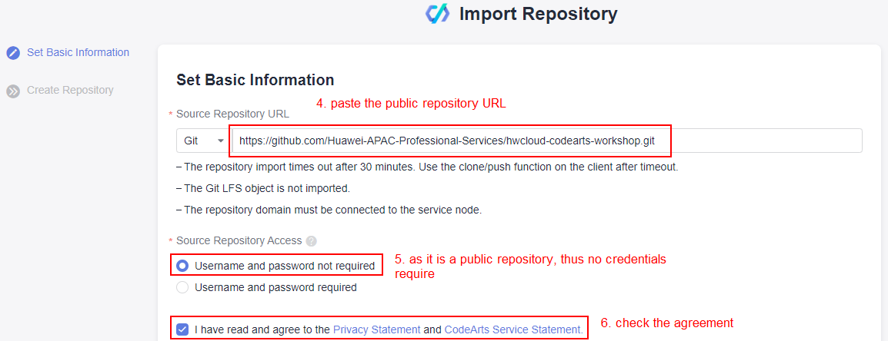 </p>*
    *<p align="center"> Figure 3.2: Import Source Code Template into CodeArts Repo </p>*
    *<p align="center"> 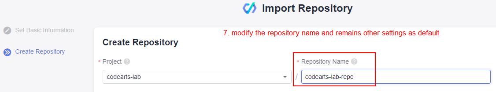 </p>*
    *<p align="center"> Figure 3.3: Import Source Code Template into CodeArts Repo </p>*

3. Now you have a copy of source code in your CodeArts Repo. In order to facilitate the **code editing process** and **source code commit changes** to trigger the pipeline process in the later exercise, you are require to clone the repository into your local machine. <br>
(**Notes**: Ensure that you have completed the prerequisites with **Git** installed on your local machine) <br>

   a. Clone the repository to your local machine by selecting **clone with HTTPS** option with the use of git clone command as below. Replace the code repository URL to your own repository URL.
   \
    ```$ git clone https://replace-it-with-your-code-repo-url.git```
    *<p align="center"> 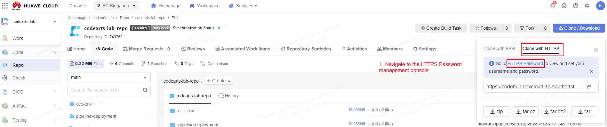 </p>*
    *<p align="center"> Figure 3.4: Clone the CodeArts Repository </p>*

   b. During the first time of repository cloning, you are require to enter the **username** and **HTTPS Password**, follow the instruction below to obtain the credentials in order to complete the clone process. The HTTPS password should be the password that used to login to the Huawei Cloud account. <br>
   \
   *<p align="center"> 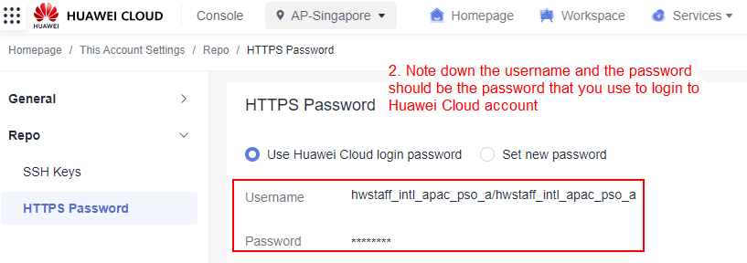 </p>*
   *<p align="center"> Figure 3.5: Clone the CodeArts Repository </p>*

   c. Navigate to the cloned directory and modify the content of the cloned files. Commit changes to the CodeArts Repo to **verify that you can perform code commit from your local machine**.

   ```$ touch abc.txt``` <br>
   ```$ git add --all``` <br>
   ```$ git commit -am "add test file``` <br>
   ```$ git push``` <br>
   Enter the credentials as prompted.

   d. To avoid having to frequently enter the username and password, you can use the certificate storage function of Git for password-free operation. Follow the instructions in the management console page to store the Git credentials.

### Create Software Repository Warehouse (SWR) Organization

This section guides you on configuring the SWR organization to store the container images created from CodeArts service throughout the development lifecycle.

1. Navigate to the SWR management console, and create an organization as shown below. 

    *<p align="center"> 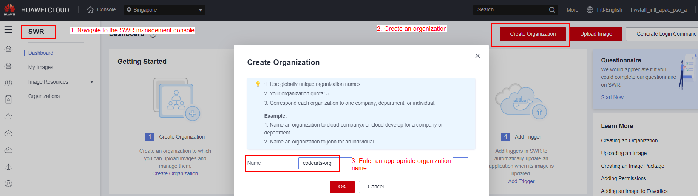 </p>*
    *<p align="center"> Figure 3.6: Create an SWR organization </p>*

2. Note down your SWR organization name for later use.

### Set up the production and non-production Huawei Cloud Container Engine (CCE) Clusters

This section guide you on provision the CCE cluster for System Integration Testing (SIT) and production environments using typical Infrastructure as Code (IaC) tool, **Terraform** to automate the resource provisioning.
(**Notes**: Ensure that you have completed the prerequisites with **Terraform** installed on your local machine)

1. If your Huawei Cloud account is a new account, you are require to authorize the use of Huawei Cloud Container Engine (CCE) cluster on CCE management console as shown below. Navigate to the CCE console and click **ok** button.

    *<p align="center"> 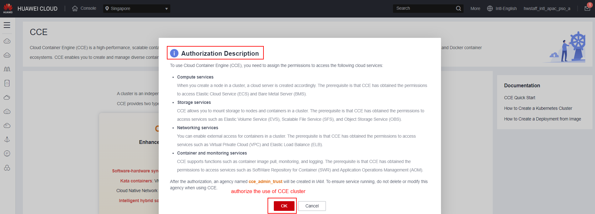 </p>*
    *<p align="center"> Figure 3.7: Authorize the use of Huawei CCE </p>*

2. Before running the terraform commands, you need to obtain the AK/SK credentials and configure the environment variables on your local machine to reduce the security risk.

    1. Navigate to the **My Crendentials** management console, and create an AK/SK. Download the **.csv** file and note down the access key and secret key. <br>
        *<p align="center"> 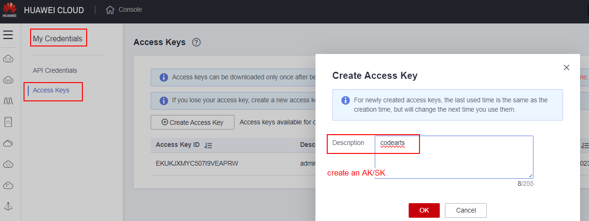 </p>*
        *<p align="center"> Figure 3.8: Create an Access Key and Secret Key </p>*

    2. Configure the environment variables on your local machine by following the commands below with appropriate selection of local environments. <br>
        1. **Linux**
            ```
            export HW_ACCESS_KEY="anaccesskey"
            export HW_SECRET_KEY="asecretkey"
            export HW_REGION_NAME="ap-southeast-3"
            ```
        2. **Windows CMD**
            ```
            setx HW_ACCESS_KEY "anaccesskey"
            setx HW_SECRET_KEY "asecretkey"
            setx HW_REGION_NAME "ap-southeast-3"
            ``` 
        3. **Powershell**
            ```
            $Env:HW_ACCESS_KEY="anaccesskey"
            $Env:HW_SECRET_KEY="asecretkey"
            $Env:HW_REGION_NAME="ap-southeast-3"
            ```

3. To provision the CCE cluster in **SIT environment**, navigate to the cloned repository with directory ```../cce-env/sit-demo```. Execute the below commands to provision the resources.

    **```$ terraform fmt```**: ensure the format is consistent within the codebase <br>
    **```$ terraform init```**: initialize the local environments, install the plugins and modules <br>
    **```$ terraform validate```**: validate if there is any syntax errors <br>
    **```$ terraform plan```**: output the configuration plan for review <br>
    **```$ terraform apply -auto-approve```**: apply changes to the environments

    *<p align="center"> 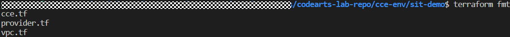 </p>*
    *<p align="center"> Figure 3.9: Result from terraform fmt command </p>*

    *<p align="center"> 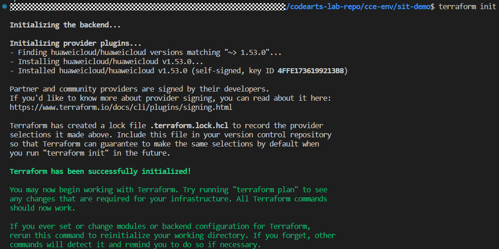 </p>*
    *<p align="center"> Figure 3.10: Result from terraform init command </p>*

    *<p align="center"> 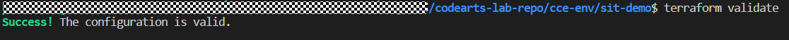 </p>*
    *<p align="center"> Figure 3.11: Result from terraform validate command </p>*

    *<p align="center"> 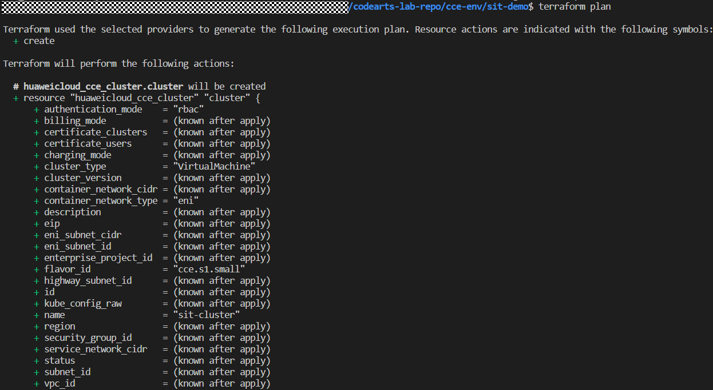 </p>*
    *<p align="center"> Figure 3.12: Result from terraform plan command </p>*

    *<p align="center"> 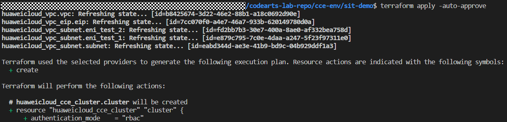 </p>*
    *<p align="center"> Figure 3.13: Result from terraform apply command </p>*

    **Navigate to the CCE management console and check whether the CCE cluster is successfully created.**

    *<p align="center"> 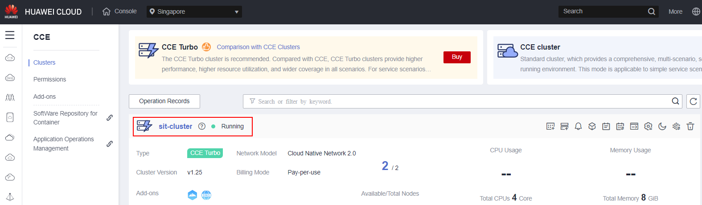 </p>*
    *<p align="center"> Figure 3.14: CCE Cluster for SIT environment </p>*

3. To provision the CCE cluster in **production environment**, navigate to the cloned repository with directory ```../cce-env/prod-demo```. Execute the below commands to provision the resources.

    **```$ terraform fmt```**: ensure the format is consistent within the codebase <br>
    **```$ terraform init```**: initialize the local environments, install the plugins and modules <br>
    **```$ terraform validate```**: validate if there is any syntax errors <br>
    **```$ terraform plan```**: output the configuration plan for review <br>
    **```$ terraform apply -auto-approve```**: apply changes to the environments

    **Navigate to the CCE management console and check whether the CCE cluster is successfully created.**

    *<p align="center"> 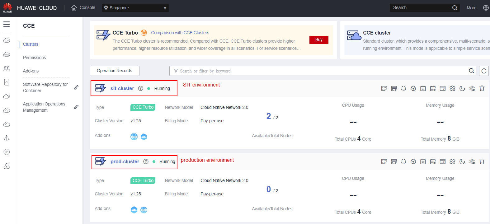 </p>*
    *<p align="center"> Figure 3.15: CCE Cluster for production environment </p>*

### Configure Kubernetes Endpoints in Huawei CodeArts Service

This section guides you on how to configure the Kubernetes cluster endpoints in CodeArts service to facilitate the automated development and deployment process.

1. You are require to obtain the information such as **kubeconfig file** and **Kubernetes URL** in order to configure the service endpoints in CodeArts service. You can obtain the information via the CCE cluster management console.

    a. Navigate to the CCE clsuter for **SIT environment**, locate the **EIP address of the cluster** and downlaod the **kubeconfig file** for later use.
        *<p align="center"> 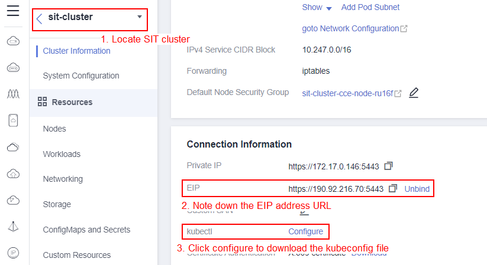 </p>*
        *<p align="center"> Figure 3.16: Obtain Cluster EIP and download kubeconfig file </p>*
        *<p align="center"> 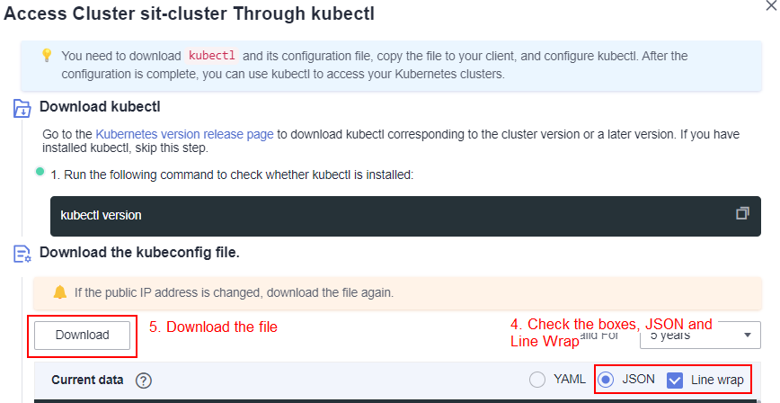 </p>*
        *<p align="center"> Figure 3.17: Obtain Cluster EIP and download kubeconfig file </p>*

    b. Navigate to the CCE clsuter for **production environment**, repeat the previous steps by locating the EIP address of the cluster and downlaod the kubeconfig file for later use.

2. Navigate to the CodeArts management console, locate the project setting and configure the Kubernetes service endpoint. You should insert the **service endpoint name**, **cluster EIP** and **kubeconfig contents** for both **SIT and production cluster**.

    a. Configure the service endpoint for SIT cluster.
        *<p align="center"> 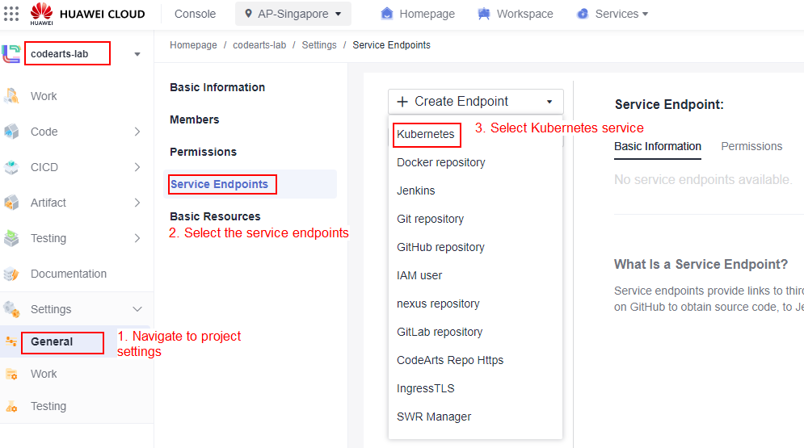 </p>*
        *<p align="center"> Figure 3.18: Configure SIT CCE cluster service endpoint </p>*

    b. When copying the kubeconfig file, ensure that you have **remove all the indentation** before the starting of each new line, else the verification on endpoints will failed. You can use the below shortcut to remove indentation in JSON format if you are using the Visual Studio Code Editor to open the JSON file. Enter the shortcut multiple times until you remove all the indentations.
        ```
        Ctrl + A
        Shift + Tab
        ```
        *<p align="center"> 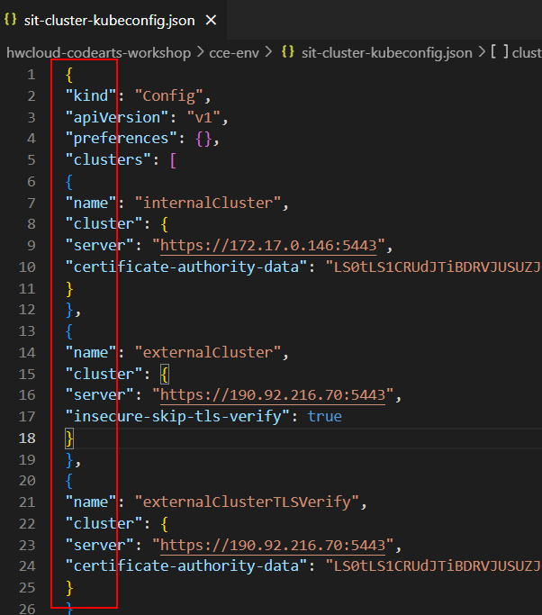 </p>*
        *<p align="center"> Figure 3.19: Remove indentations in JSON format </p>*
        *<p align="center"> 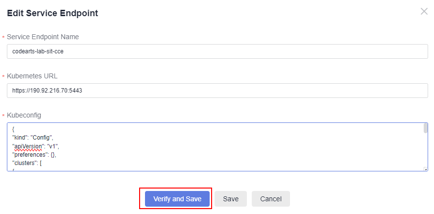 </p>*
        *<p align="center"> Figure 3.20: Configure SIT CCE cluster service endpoint </p>*

    b. Configure the service endpoint for **production cluster** by following the previous **Steps a** and **b**.


    


