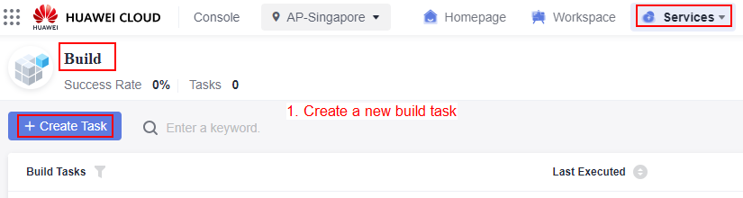
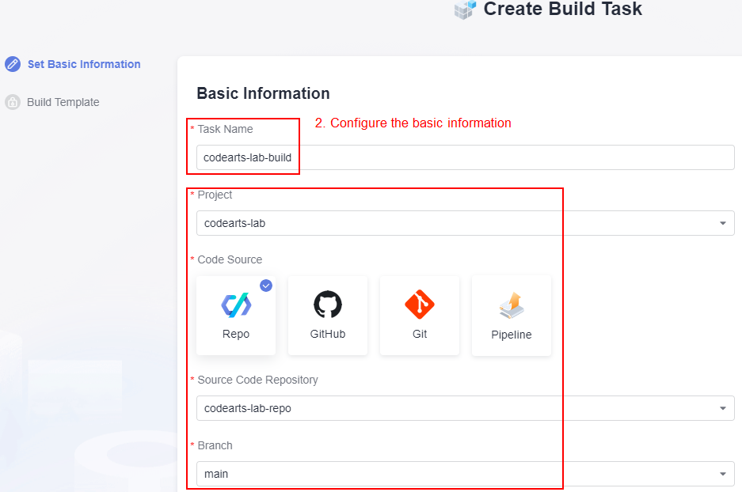
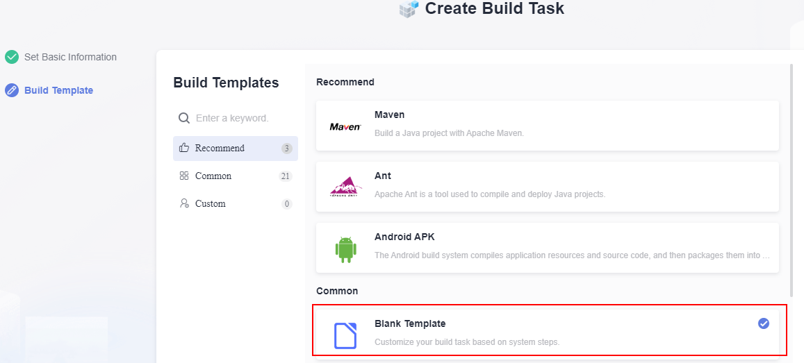
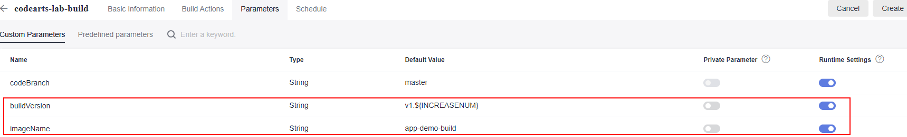
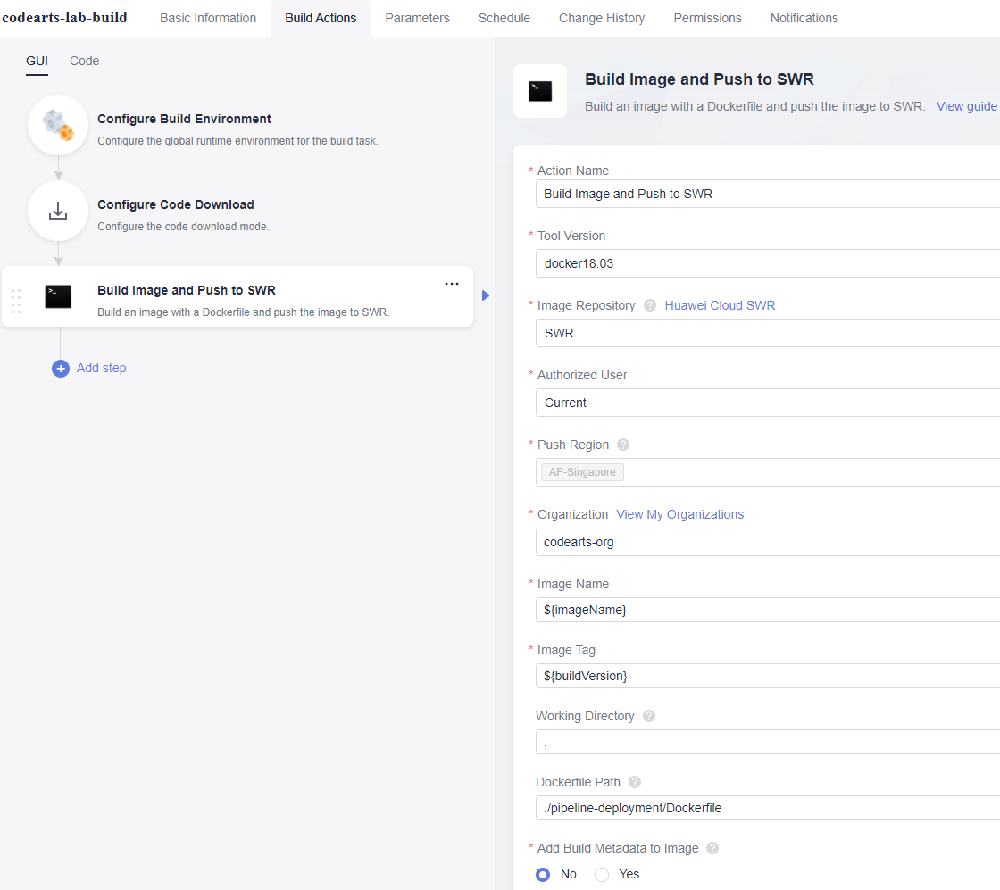
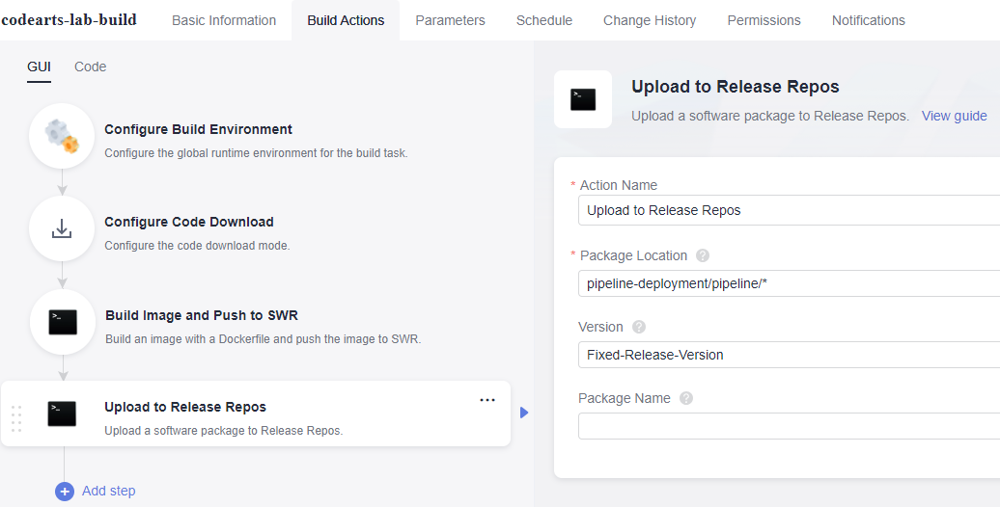
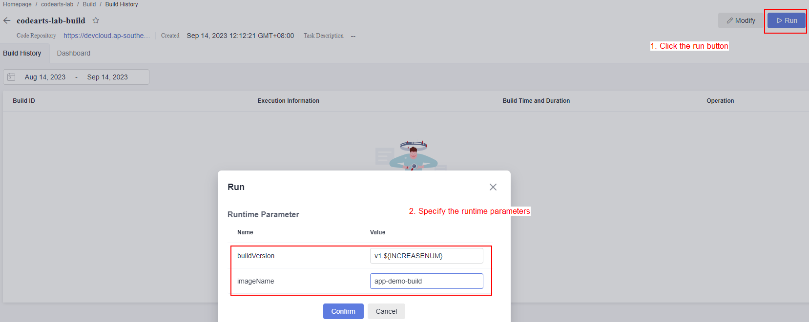
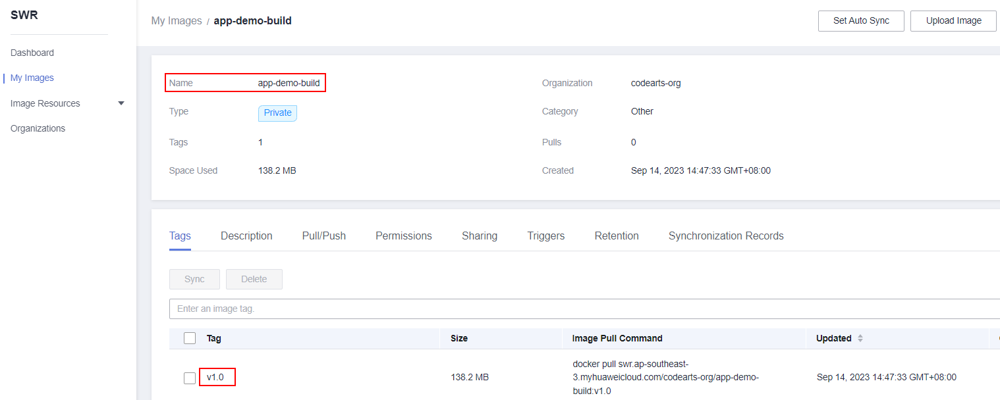
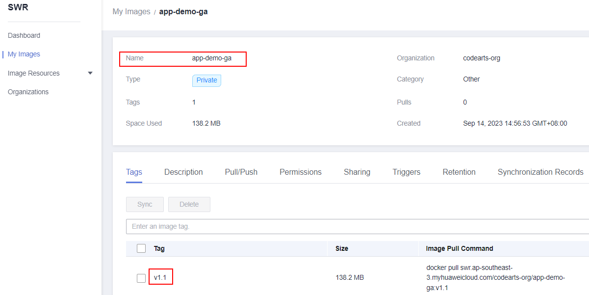

# Configure the Build Task using CodeArts Build

This section will guides you on configuring the build task using the built-in function in CodeArts Build feature. This build task is aims to package your application source code into a container image based on the Dockerfile that you have configured and uploaded in CodeArts Repo. The resulting container image will be versioned, tagged, and stored in Software Repository Warehouse (SWR) for development and deployment across different environments.

### Configure CodeArts Build Task

The steps below guides you on configuring the build task on management console.

1. Navigate to the CodeArts Build service management console and create a new build task.
    *<p align="center">  </p>*
    *<p align="center"> Figure 4.0: Configure the CodeArts Build task </p>*

2. Configure the basic information of the build task. Enter a meaningful name for the build task and select your CodeArts Repo repository.
    *<p align="center">  </p>*
    *<p align="center"> Figure 4.1: Configure the CodeArts Build task </p>*

3. Using a blank template to customize the build functions.
    *<p align="center">  </p>*
    *<p align="center"> Figure 4.2: Configure the CodeArts Build task </p>*

4. Configure the custom paramaters such as the **imageName** and the **buildVersion**. The defined image name and the build version will be used as a tag to be displayed in the SWR hosting service. Enable the runtime setting for both paramaters.

    **imageName**: ```app-demo-build``` <br>
    **buildVersion**: ```v1.${INCREASENUM}```

    *<p align="center">  </p>*
    *<p align="center"> Figure 4.3: Configure the CodeArts Build task </p>*

5. Add a new function named as ```Build Image and Push to SWR```. Configure the function paramater as stated below while others remain as default.

    **Push Region**: ```AP-Singapore``` <br>
    **Organization**: ```enter-your-swr-organization-name``` <br>
    **Image Name**: ```${imageName}``` <br>
    **Image Tag**: ```${buildVersion}``` <br>
    **Dockerfile Path**: ```./pipeline-deployment/Dockerfile```

    *<p align="center">  </p>*
    *<p align="center"> Figure 4.4: Configure the CodeArts Build task </p>*

5. Add another new function named as ```Upload to Release Repos```. Configure the function paramater as stated below while others remain as default.

    **Package Location**: ```pipeline-deployment/pipeline/*``` <br>
    **Version**: ```Fixed-Release-Version```

    *<p align="center">  </p>*
    *<p align="center"> Figure 4.5: Configure the CodeArts Build task </p>*

### Execute the CodeArts Build Task

In order to facilitate the future development and deployment process, you are require to push a version of image to the SWR hosting service. There are two images that need to be pushed for the use of different environments. With the history version of images presence in SWR service, then only we can leverage the CodeArts Deploy service to update the application features accrodingly with different version tag.

1. Execute the CodeArts Build Task with the specify build paramaters as below to create an image for SIT environments. This image will be updated using the Continuous Integration (CI) pipeline whenever there is a new application features available. Once the task executed successfully, verify the image is being pushed to SWR.

    **imageName**: ```app-demo-build``` <br>
    **buildVersion**: ```v1.${INCREASENUM}```

    *<p align="center">  </p>*
    *<p align="center"> Figure 4.6: Execute the CodeArts Build task </p>*

    *<p align="center">  </p>*
    *<p align="center"> Figure 4.7: Container image for SIT environment </p>*

2. Execute the CodeArts Build Task with the specify build paramaters as below to create an image for production environments. This image will be updated using the Continuous Integration (CD) pipeline whenever there is a new application features available and have been tested in CI pipeline. Once the task executed successfully, verify the image is being pushed to SWR.

    **imageName**: ```app-demo-ga``` <br>
    **buildVersion**: ```v1.${INCREASENUM}```

    *<p align="center">  </p>*
    *<p align="center"> Figure 4.8: Container image for production environment </p>*