# Configure an automated Continuous Integration (CI) Pipeline using CodeArts Service

This section guides you on configuring the task to be included in an automated Continuous Integration (CI) pipeline such as CodeArts Check, CodeArts Build, CodeArts Deploy and CodeArts Pipeline. This automated pipeline is aims to achieve an automation on development lifecycle by deploying an application in the system integration testing environment with iamge tagging before a stable version of image can be released to production environment. The pipeline would be triggerred automatically upon source code commit.

### Configure the CodeArts Check Task

This section will guides you on configuring the CodeArts Check task where this task will performs a series of check based on the pre-defined rules in the knowledge base to detect if any syntax error presence within the codebase.

1. Navigate to the CodeArts Check management console, execute the code check for the first time. 

    *<p align="center"> 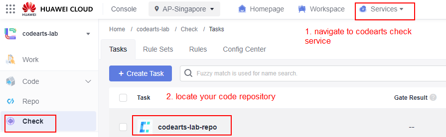 </p>*
    *<p align="center"> Figure 5.0: Execute the CodeArts Check Task </p>*

2. During the first time of the code check, the system will detect the language used in your application code and apply the appropriate system-defined rule sets on your code throughout the check process.

    *<p align="center"> 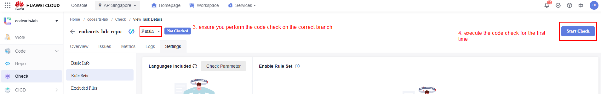 </p>*
    *<p align="center"> Figure 5.1: Execute the CodeArts Check Task </p>*

    *<p align="center"> 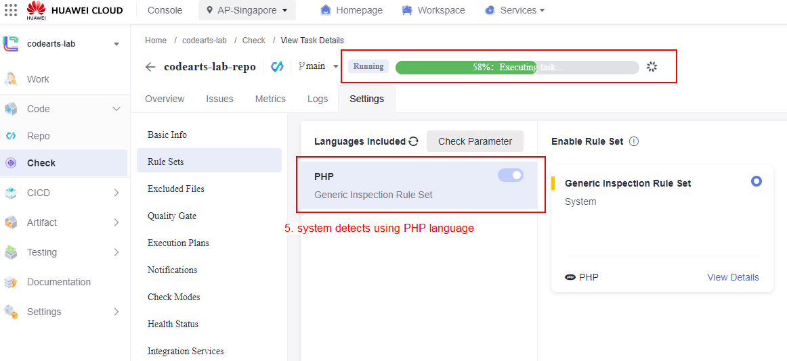 </p>*
    *<p align="center"> Figure 5.2: Execute the CodeArts Check Task </p>*

### Configure the CodeArts Deploy Task

This section will guides you on configuring the CodeArts Deploy task where this task is responsible in deploying the application to the SIT environment by using the container image being built and stored in SWR service. The whole process is being executed via the function configured in the deployment task.

1. Navigate to the CodeArts Deploy management console, configure a new deployment task and insert a new function named as ```Kubernetes Custom Cluster Deployment```.

    *<p align="center"> 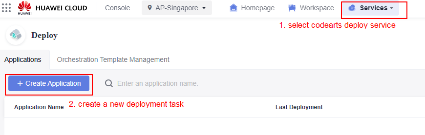 </p>*
    *<p align="center"> Figure 5.3: Configure CodeArts Deploy Task</p>*

    *<p align="center"> 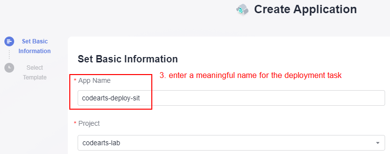 </p>*
    *<p align="center"> Figure 5.4: Configure CodeArts Deploy Task</p>*

    *<p align="center"> 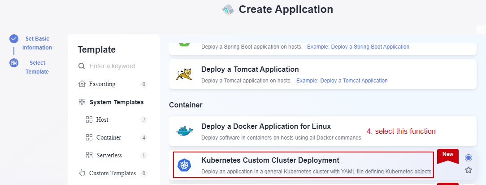 </p>*
    *<p align="center"> Figure 5.5: Configure CodeArts Deploy Task</p>*

2. Configure the custom parameters with the value as stated below. Enable the runtime setting for the **imageName** and **buildVersion** parameter.

    **imageName**: ```app-demo-build``` <br>
    **buildVersion**: ```v1.0``` <br>
    **orgName**: ```enter-your-swr-organization-name``` <br>
    **swrURL**: ```swr.ap-southeast-3.myhuaweicloud.com``` <br>

    *<p align="center"> 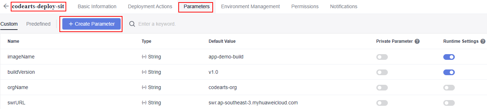 </p>*
    *<p align="center"> Figure 5.6: Configure custom parameter for CodeArts Deploy Task</p>*

3. Configure the ```Kubernetes Custom Cluster Deployment``` function setting with the values as stated below. Click the save button on the upper right to save the configuration.

    **Kubernetes Service Endpoint**: ```enter-your-sit-cluster-service-endpoint-name``` <br>
    **kubectl Command**: ```apply``` <br>
    **File Source**: ```Artifacts``` <br>
    **YAML File/Folder**: ```/codearts-lab-build/Fixed-Release-Version/sit-app-demo-recreate.yaml```

    *<p align="center"> 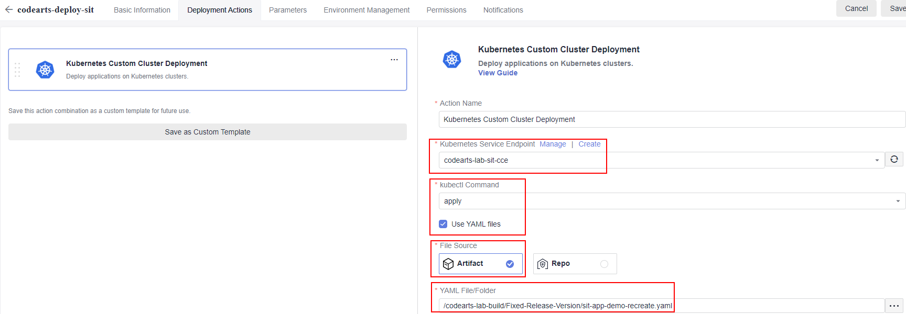 </p>*
    *<p align="center"> Figure 5.7: Configure CodeArts Deploy Task</p>*

### Configure the Continuous Integration (CI) Pipeline

This section will guides you on configuring the Continuous Integration (CI) Pipeline that will result in an application being deployed to the SIT environment via a series of sub-task configured in the pipeline that includes code check, build and deploy actions.

1. Navigate to the CodeArts Pipeline management console and create a new pipeline by giving it a meaningful name. Select a blank template for task customization purpose.

    *<p align="center"> 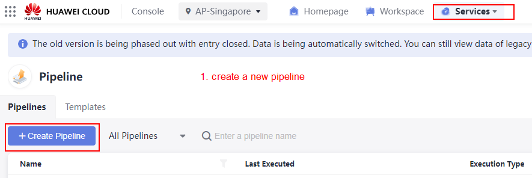 </p>*
    *<p align="center"> Figure 5.8: Configure CodeArts Pipeline</p>*

    *<p align="center"> 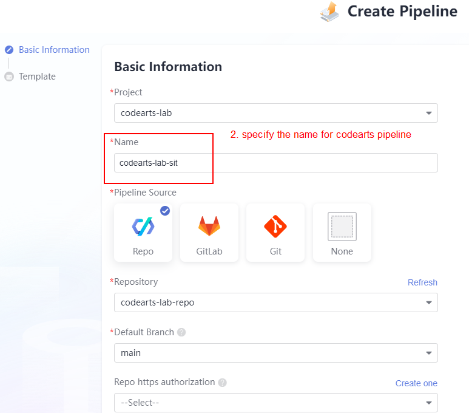 </p>*
    *<p align="center"> Figure 5.9: Configure CodeArts Pipeline</p>*

    *<p align="center"> 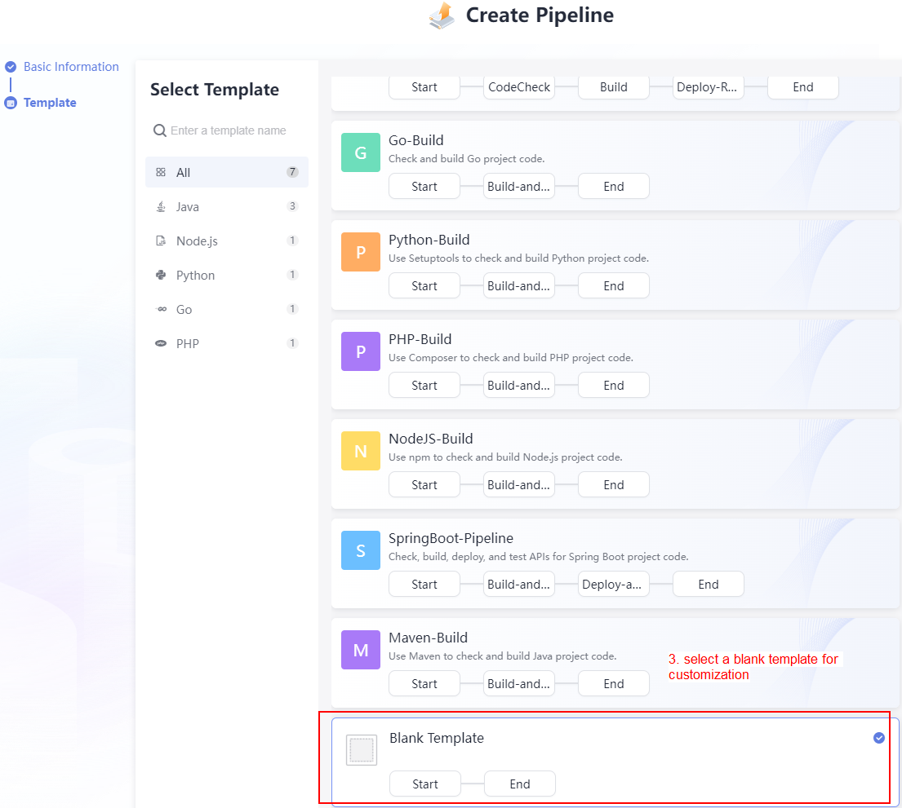 </p>*
    *<p align="center"> Figure 5.10: Configure CodeArts Pipeline</p>*

2. Configure the custom parameters with the value as stated below. Enable the runtime setting for the **imageName** and **buildVersion** parameter.

    **imageName**: ```app-demo-build``` <br>
    **buildVersion**: ```v1.0```

    *<p align="center"> 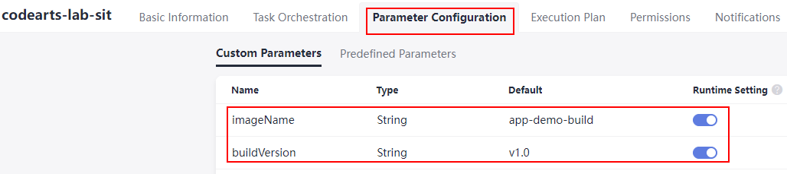 </p>*
    *<p align="center"> Figure 5.11: Configure custom parameters for CodeArts Pipeline</p>*

3. Configure the CodeArts Check task in CI pipeiline. Select the CodeArts Check task that had configured earlier.

    *<p align="center"> 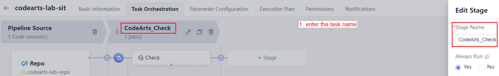 </p>*
    *<p align="center"> Figure 5.12: Configure CodeArts Pipeline</p>*

    *<p align="center"> 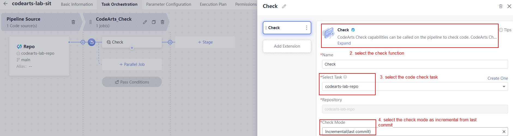 </p>*
    *<p align="center"> Figure 5.13: Configure CodeArts Pipeline</p>*

4. Configure the CodeArts Build task in CI pipeiline. Select the CodeArts Build task that had configured earlier and configure the **imageName** and **buildVersion** values as stated below.

    **imageName**: ```${imageName}``` <br>
    **buildVersion**: ```v1.0-${TIMESTAMP}``` <br>

    *<p align="center"> 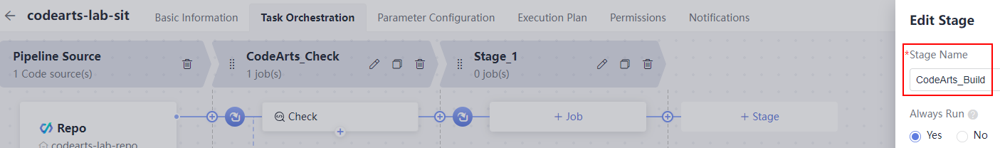 </p>*
    *<p align="center"> Figure 5.14: Configure CodeArts Pipeline</p>*

    *<p align="center"> 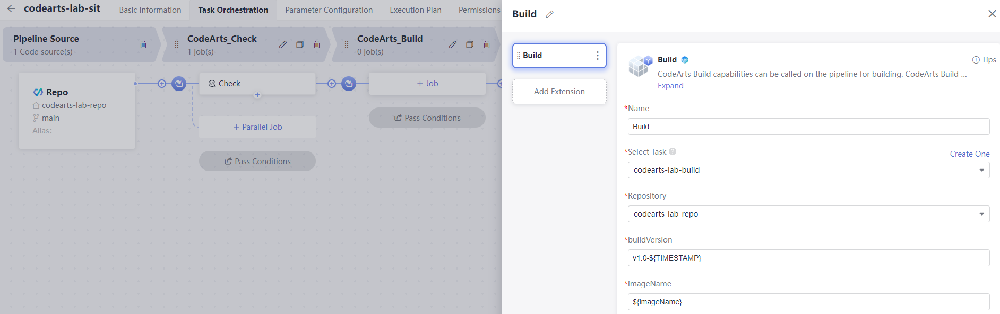 </p>*
    *<p align="center"> Figure 5.15: Configure CodeArts Pipeline</p>*

5. Configure the CodeArts Deploy task in CI pipeiline. Select the CodeArts Deploy task that had configured earlier and configure the **imageName** and **buildVersion** values as stated below.

    **imageName**: ```${imageName}``` <br>
    **buildVersion**: ```v1.0-${TIMESTAMP}``` <br>

    *<p align="center"> 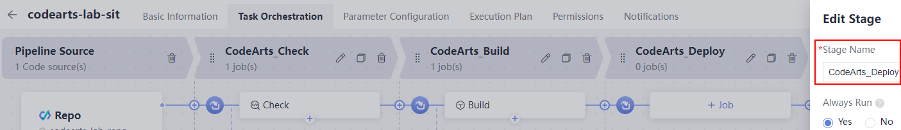 </p>*
    *<p align="center"> Figure 5.16: Configure CodeArts Pipeline</p>*

    *<p align="center"> 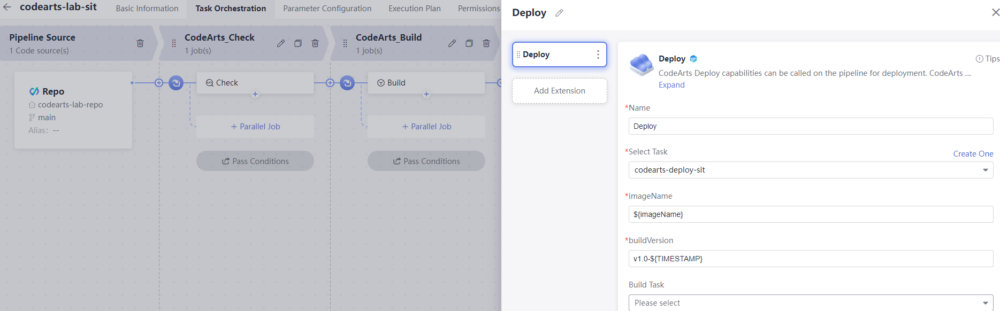 </p>*
    *<p align="center"> Figure 5.17: Configure CodeArts Pipeline</p>*

6. Configure the execution plan of the CI pipeline to be triggered upon source code commit to the main branch. Enable the code commit option as below.

    *<p align="center"> 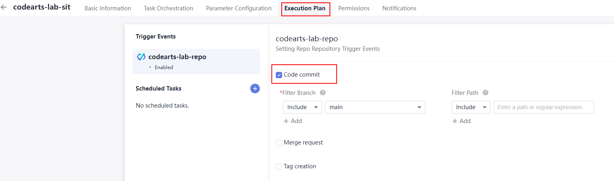 </p>*
    *<p align="center"> Figure 5.18: Configure CodeArts Pipeline execution plan</p>*

### Execute the Continuous Integration (CI) Pipeline

This section guides you on testing the CI pipeline by commit changes to the CodeArts Repo to automatically trigger the CI pipeline.

1. From your local machine, navigate to your source code directory and locate the ```./pipeline-deployment/project/index.php``` file. Modify the source code to deploy a web application with **red color background**, uncomment the line that marked as red color code.

    ```
    header {
        /* Red */
        background: linear-gradient(135deg, rgba(255, 176, 176, 0.8), rgba(255, 0, 0, 0.967));

        ...
    }

    ```

2. Execute the Git command below to commit changes to the CodeArts Repo. Enter the Git credentials as prompted, the username and password should be the one you have obtained in [Step 3b](https://github.com/Huawei-APAC-Professional-Services/hwcloud-codearts-workshop-v2/blob/main/workshop/02_Getting_Started.md).

    ```$ git add --all``` <br>
    ```$ git commit -am "release red version``` <br>
    ```$ git push```

    *<p align="center"> 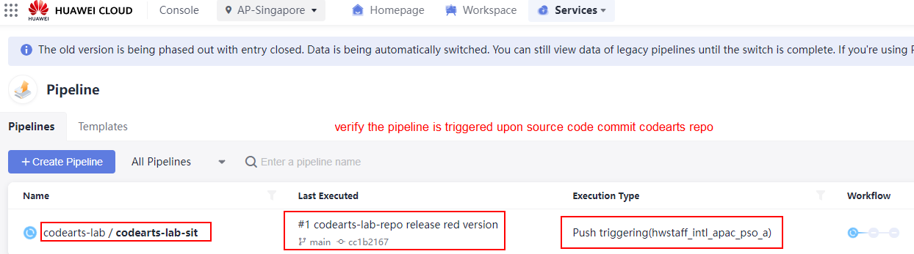 </p>*
    *<p align="center"> Figure 5.19: Execute Continuous Integration (CI) Pipeline</p>*

    *<p align="center"> 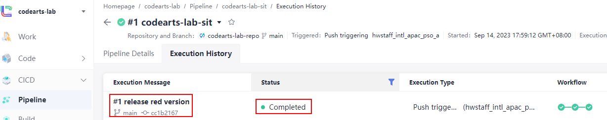 </p>*
    *<p align="center"> Figure 5.20: Execute Continuous Integration (CI) Pipeline</p>*

### Verify the web application is successfully deployed to SIT environment

You are require to do a system validation once you have completed the execution on CI pipeline. The checking includes the container image have been pushed to SWR and the web application is working fine with the use of load balancer service being bound to the deployment.

1. Perform checking on the container image in SWR service. Verify that there is a new version of image being pushed to SWR service with **a solid number tagged with timestamp** as below.

    *<p align="center"> 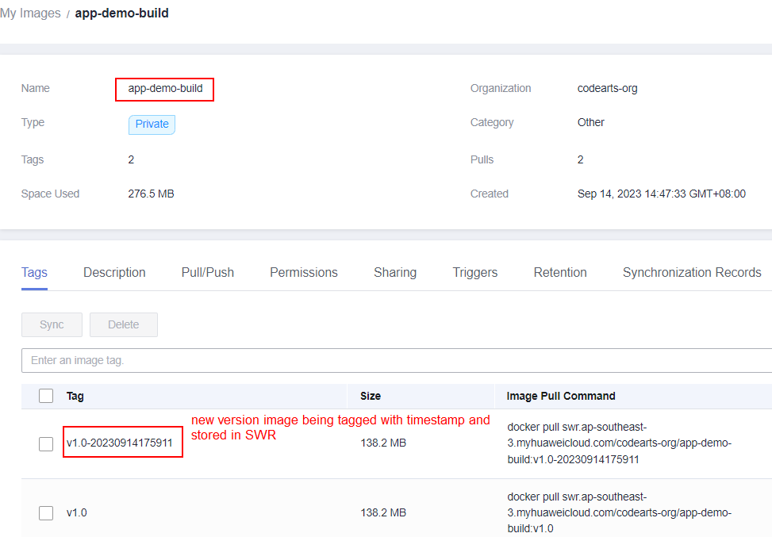 </p>*
    *<p align="center"> Figure 5.21: Verification on new version image pushed to SWR service</p>*

2. Before accessing the web application, you are require to configure the load balancer service on the management console to expose your web application to the internet so that your **web application is accessible with the use of the public EIP**.

    a. Navigate to the CCE cluster management console for SIT environments, configure the **load balancer service** using the information as stated below.

    * **Service Name**: ```sit-srv``` <br>
    * **Namespace**: ```ns-devops``` <br>
    * **Selector**: ```app = php-fpm-nginx``` <br>
    * **Load Balancer**: ```Auto Create Shared Load Balancer``` <br>
    * **Port**: ```80```
    
    *<p align="center"> 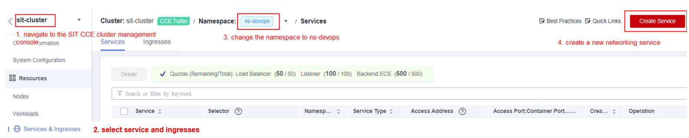 </p>*
    *<p align="center"> Figure 5.22: Configure load balancer service</p>*
    *<p align="center"> 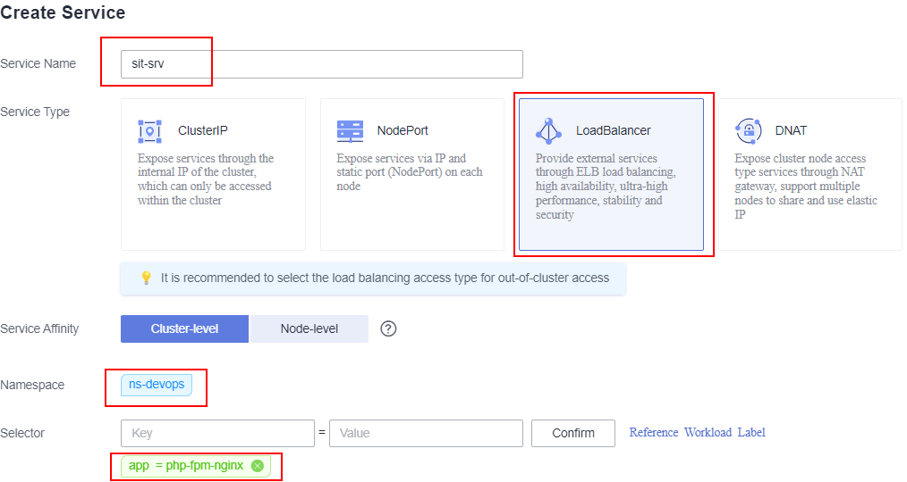 </p>*
    *<p align="center"> Figure 5.23: Configure load balancer service</p>*
    *<p align="center"> 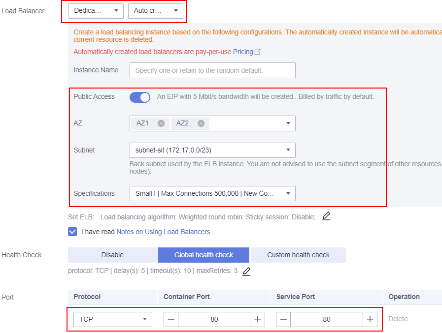 </p>*
    *<p align="center"> Figure 5.24: Configure load balancer service</p>*

    b. Verify the load balancer have created successfully and obtain the **EIP address of the ELB**.

    *<p align="center"> 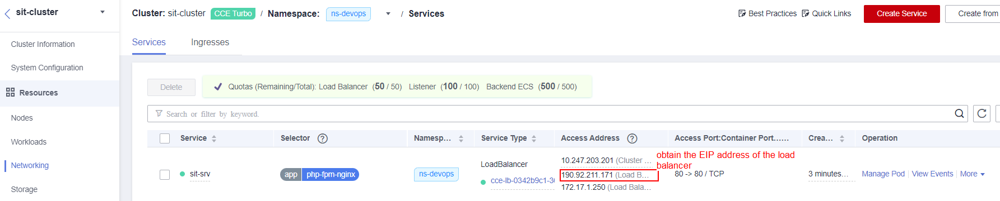 </p>*
    *<p align="center"> Figure 5.25: Load balancer service in CCE</p>*

    c. Paste the EIP address to any web browser and you should able to view a similar web page as below.

    *<p align="center"> 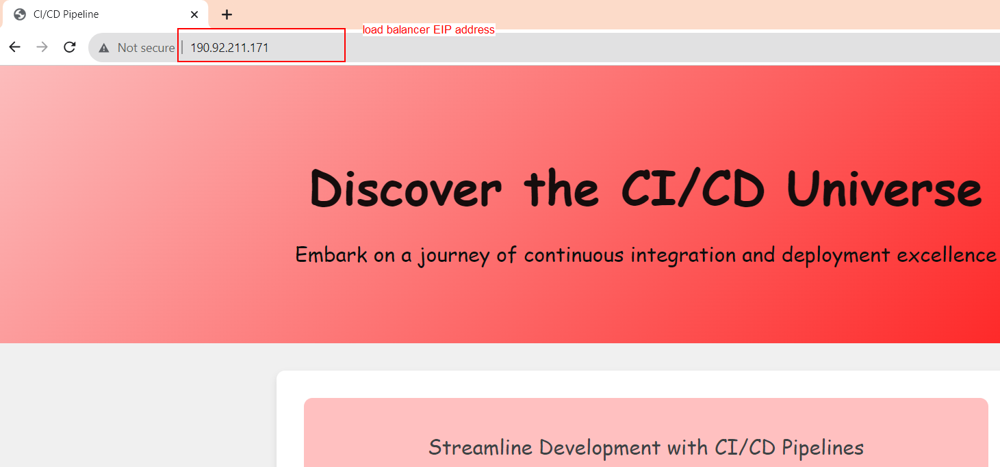 </p>*
    *<p align="center"> Figure 5.26: Accessing the web application</p>*