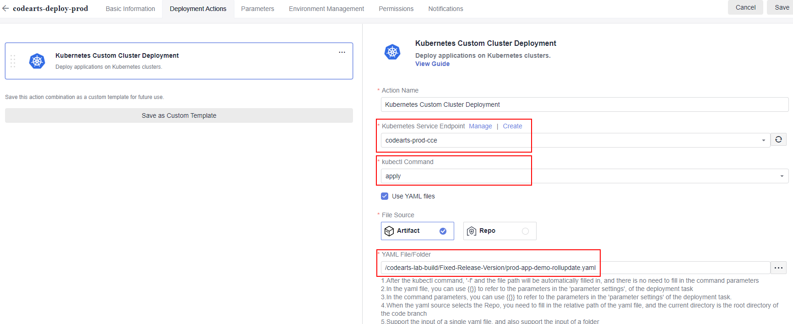
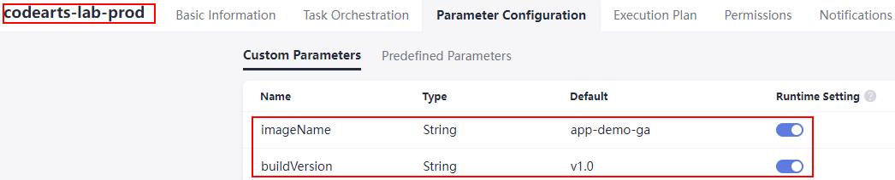
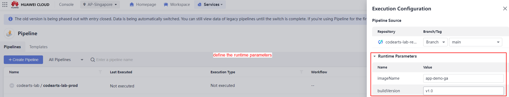
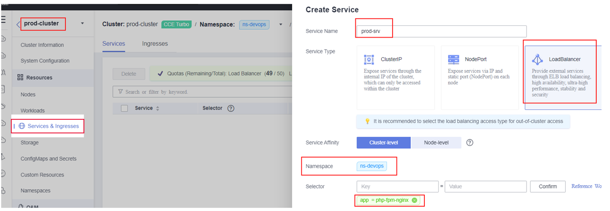

# Configure an automated Continuous Deployment (CD) Pipeline using CodeArts Service

This section guides you on configuring the task to be included in an automated Continuous Deployment (CD) pipeline such as CodeArts Build, CodeArts Deploy and CodeArts Pipeline. This automated pipeline aims to deploy a web application to the production environment with the use of the same version of application code that had been tested in SIT environment. The pipeline was manually triggered and the version to be released to the production environment is determine by the project manager once he or she had review the pipeline application process.

### Configure the CodeArts Deploy Task

This section will guides you on configuring the CodeArts Deploy task where this task is responsible in deploying the application to the production environment by using the container image being built and stored in SWR service. The whole process is being executed via the function configured in the deployment task.

1. Navigate to the CodeArts Deploy management console, configure a new deployment task and insert a new function named as ```Kubernetes Custom Cluster Deployment```.

    *<p align="center">  </p>*
    *<p align="center"> Figure 6.0: Configure CodeArts Deploy Task</p>*

    *<p align="center">  </p>*
    *<p align="center"> Figure 6.1: Configure CodeArts Deploy Task</p>*

2. Configure the custom parameters with the value as stated below. Enable the runtime setting for the **imageName** and **buildVersion** parameter.

    **imageName**: ```app-demo-ga``` <br>
    **buildVersion**: ```v1.0``` <br>
    **orgName**: ```enter-your-swr-organization-name``` <br>
    **swrURL**: ```swr.ap-southeast-3.myhuaweicloud.com``` <br>

    *<p align="center">  </p>*
    *<p align="center"> Figure 6.2: Configure custom parameter for CodeArts Deploy Task</p>*

3. Configure the ```Kubernetes Custom Cluster Deployment``` function setting with the values as stated below. Click the save button on the upper right to save the configuration.

    **Kubernetes Service Endpoint**: ```enter-your-production-cluster-service-endpoint-name``` <br>
    **kubectl Command**: ```apply``` <br>
    **File Source**: ```Artifacts``` <br>
    **YAML File/Folder**: ```/codearts-lab-build/Fixed-Release-Version/prod-app-demo-rollupdate.yaml```

    *<p align="center">  </p>*
    *<p align="center"> Figure 6.3: Configure CodeArts Deploy Task</p>*

### Configure the Continuous Deployment (CD) Pipeline

This section will guides you on configuring the Continuous Deployment (CD) Pipeline that will result in an application being deployed to the production environment via a series of sub-task configured in the pipeline that includes code check, build and deploy actions.

1. Navigate to the CodeArts Pipeline management console and create a new pipeline by giving it a meaningful name. Select a blank template for task customization purpose.

    *<p align="center">  </p>*
    *<p align="center"> Figure 6.4: Configure CodeArts Pipeline</p>*

    *<p align="center">  </p>*
    *<p align="center"> Figure 6.5: Configure CodeArts Pipeline</p>*

2. Configure the custom parameters with the value as stated below. Enable the runtime setting for the **imageName** and **buildVersion** parameter.

    **imageName**: ```app-demo-ga``` <br>
    **buildVersion**: ```v1.0```

    *<p align="center">  </p>*
    *<p align="center"> Figure 6.6: Configure custom parameters for CodeArts Pipeline</p>*

3. Configure the CodeArts Build task in CI pipeiline. Select the CodeArts Build task that had configured earlier and configure the **imageName** and **buildVersion** values as stated below.

    **imageName**: ```${imageName}``` <br>
    **buildVersion**: ```${buildVersion}``` <br>

    *<p align="center">  </p>*
    *<p align="center"> Figure 6.7: Configure CodeArts Pipeline</p>*

4. Configure the CodeArts Pipeline manual review task. This manual review will need to approve by the project manager before the pipeline can continue to execute the deployment task.

    *<p align="center">  </p>*
    *<p align="center"> Figure 6.8: Configure CodeArts Pipeline</p>*

5. Configure the CodeArts Deploy task in CI pipeiline. Select the CodeArts Deploy task that had configured earlier and configure the **imageName** and **buildVersion** values as stated below.

    **imageName**: ```${imageName}``` <br>
    **buildVersion**: ```${buildVersion}``` <br>

    *<p align="center">  </p>*
    *<p align="center"> Figure 6.9: Configure CodeArts Pipeline</p>*

### Execute the Continuous Deployment Pipeline

This section guides you on executing the CD pipeline via the manual method. We will use the same version of application source code that had deployed in SIT environment to deploy a same version of application to the production environment.

1. Trigger the CD pipeline by click on the run button as below and define the runtime parameters.

    *<p align="center">  </p>*
    *<p align="center"> Figure 6.10: Execute CodeArts Pipeline</p>*

2. Manually approve the pipeline process to allow the deoployment to the production environment.

    *<p align="center">  </p>*
    *<p align="center"> Figure 6.11: Execute CodeArts Pipeline</p>*

3. Manually approve the CodeArts Pipeline process so that pipeline can continue its task to deploy web application to the production environment.

    *<p align="center">  </p>*
    *<p align="center"> Figure 6.12: Manually approve the CodeArts Pipeline process</p>*

4. Verify the CD pipeline had executed successfully.

    *<p align="center">  </p>*
    *<p align="center"> Figure 6.13: Verify the CodeArts Pipeline process</p>*

### Verify the web application is successfully deployed to production environment

You are require to do a system validation once you have completed the execution on CD pipeline. The checking includes the container image have been pushed to SWR and the web application is working fine with the use of load balancer service being bound to the deployment.

1. Perform checking on the container image in SWR service. Verify that there is a new version of image being pushed to SWR service with **a solid number** tagged as below.

    *<p align="center">  </p>*
    *<p align="center"> Figure 6.14: Verification on new version image pushed to SWR service</p>*

2. Before accessing the web application, you are require to configure the load balancer service on the management console to expose your web application to the internet so that your **web application is accessible with the use of the public EIP**.

    a. Navigate to the CCE cluster management console for production environments, configure the **load balancer service** using the information as stated below.

    * **Service Name**: ```prod-srv``` <br>
    * **Namespace**: ```ns-devops``` <br>
    * **Selector**: ```app = php-fpm-nginx``` <br>
    * **Load Balancer**: ```Auto Create Shared Load Balancer``` <br>
    * **Port**: ```80```
    
    *<p align="center">  </p>*
    *<p align="center"> Figure 6.15: Configure load balancer service</p>*
    *<p align="center">  </p>*
    *<p align="center"> Figure 6.16: Configure load balancer service</p>*

    b. Verify the load balancer have created successfully and obtain the **EIP address of the ELB**.

    *<p align="center">  </p>*
    *<p align="center"> Figure 6.17: Load balancer service in CCE</p>*

    c. Paste the EIP address to any web browser and you should able to view a similar web page as below.

    *<p align="center">  </p>*
    *<p align="center"> Figure 6.18: Accessing the web application</p>*