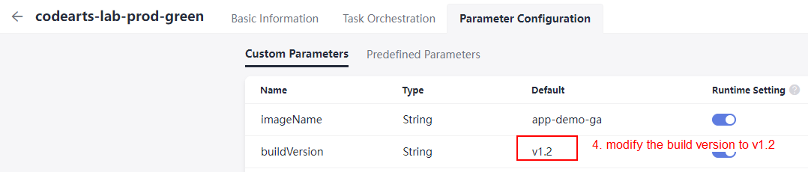
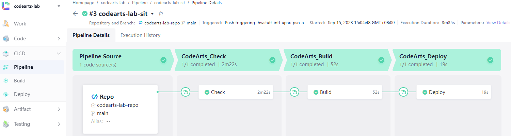
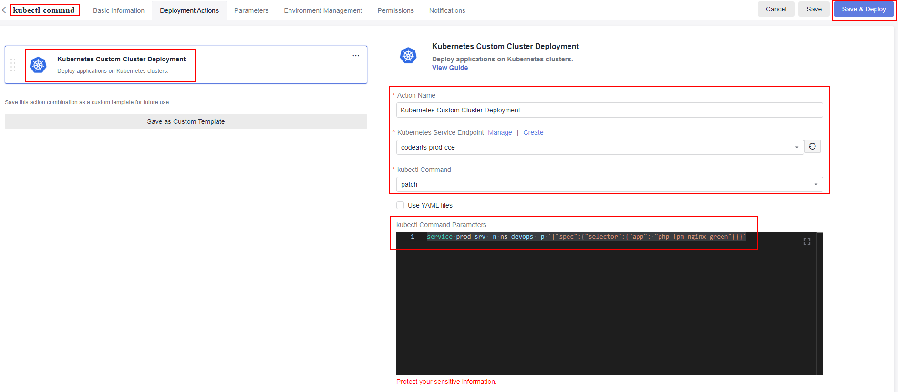

# Configure Blue-green deployment strategy for the production environment using CodeArts Service

At this stage, you have completed the configuration on **Continuous Integration (CI)** and **Continuous Deployment (CD)** pipeline. Now, we are going to simulate the **blue-green deployment strategy in the production environment**. As shown in **Figure 7.0**, there will be two versions of the web application being deployed to the production cluster where one application is in active mode and another remains idle. The load balancer bound to the production cluster will first point to the current version **(blue color background, v1.1)** of the web application. If the new version of the application **(green color background, v1.2)** had tested successfully in the SIT environment, then the load balancer will switch to point to the new version of the web application. In case there is any failure in the new release application, you can easily switch back to the previous version as the version is retained in the production environment.

*<p align="center">  </p>*
*<p align="center"> Figure 7.0: Blue-Green deployment strategy in the production environment</p>*

### Release the first version (blue color webpage) of the web application

In an existing SIT and production environments, you already have the history version of the web application **(red color webpage)** being deployed. To release a new version of web application with blue color webpage, you are require to trigger the build and deploy for SIT and production pipeline that you have configured earlier.

1. From your local machine, navigate to your source code directory and locate the ```./pipeline-deployment/project/index.php``` file. Modify the source code to deploy a web application with **blue color background**, uncomment the line that marked as blue color code.

    ```
    header {
        /* Red */
        /*background: linear-gradient(135deg, rgba(255, 176, 176, 0.8), rgba(255, 0, 0, 0.967));*/

        /* Blue */
        background: linear-gradient(135deg, rgba(192, 218, 236, 0.8), rgba(0, 153, 255, 0.967));
        ...
    }

    ```

2. Execute the **Git command** below to commit changes to the CodeArts Repo. Enter the Git credentials as prompted, the username and password should be the one you have obtained in [Step 3b](https://github.com/Huawei-APAC-Professional-Services/hwcloud-codearts-workshop-v2/blob/main/workshop/02_Getting_Started.md).

    ```$ git add --all``` <br>
    ```$ git commit -am "release blue version``` <br>
    ```$ git push```

    *<p align="center">  </p>*
    *<p align="center"> Figure 7.1: Trigger SIT pipeline upon source code commit</p>*

3. Verify the web application had changed to **blue color background** by accessing the **EIP address of load balancer** being bound to the **SIT cluster**.

    *<p align="center">  </p>*
    *<p align="center"> Figure 7.2: Web application in SIT environment</p>*

4. Release the **blue version** web application to the production environment by manually trigger the production pipeline with defining the runtime parameters as stated below.

    **imageName**: ```app-demo-ga``` <br>
    **buildVersion**: ```v1.1``` <br>

    *<p align="center">  </p>*
    *<p align="center"> Figure 7.3: Manually trigger the production pipeline</p>*

5. Verify the web application had changed to **blue color background** by accessing the **EIP address of load balancer** being bound to the **production cluster**.

    *<p align="center">  </p>*
    *<p align="center"> Figure 7.4: Web application in production environment</p>*

### Release the second version (green color webpage) of the web application

This section guides you on configuring the second CodeArts pipeline for another deployment in production environment to simulate the blue-green deployment strategy. You are require to configure a **new CodeArts Deploy task** and a **new CodeArts Pipeline**. Then you will use this pipeline to deploy a new deployment in production environment.

1. You may **clone an existing production deployment task** and modify the configuration parameters as stated below. Save the configuration settings once you have done the modification.

    **App Name**: ```codearts-deploy-prod-green``` <br>
    **YAML File/Folder**: ```/codearts-lab-build/Fixed-Release-Version/prod-app-demo-green.yaml``` <br>

    *<p align="center">  </p>*
    *<p align="center"> Figure 7.5: Clone the CodeArts deployment task</p>*
    *<p align="center">  </p>*
    *<p align="center"> Figure 7.6: Configure the CodeArts deployment task</p>*
    *<p align="center">  </p>*
    *<p align="center"> Figure 7.7: Configure the CodeArts deployment task</p>*

2. You may **clone an existing production pipeline** and modify the configuration parameters as stated below. Save the configuration settings once you have done the modification.

    *<p align="center">  </p>*
    *<p align="center"> Figure 7.8: Clone the CodeArts Pipeline</p>*

    1. Basic Information: <br>
        **Name**: ```codearts-lab-prod-green```
        *<p align="center">  </p>*
        *<p align="center"> Figure 7.9: Configure the CodeArts Pipeline</p>*

    2. Parameter Configuration: <br>
        **buildVersion**: ```v1.2```
        *<p align="center">  </p>*
        *<p align="center"> Figure 7.10: Configure the CodeArts Pipeline</p>*

    3. Deployment task in CodeArts Pipeline: <br>
        **Select Task**: ```codearts-lab-prod-green``` <br>
        **imageName**: ```${imageName}``` <br>
        **buildVersion**: ```${buildVersion}``` <br>

        *<p align="center">  </p>*
        *<p align="center"> Figure 7.11: Configure the CodeArts Pipeline</p>*

3. At this stage, you have completed the setup of a new pipeline for the green deployment. Now, you will need to **push the green deployment to the production environment** to simulate the blue-green deployment strategy. Follow the instruction below to achieve the goal.

    a. Firstly, you are require to modify the source code to release a new version of **web application with green color background** and trigger the SIT pipeline. From your local machine, navigate to your source code directory and locate the ```./pipeline-deployment/project/index.php``` file. Modify the source code to deploy a web application with **green color background**, uncomment the line that marked as green color code. <br>
    ```
    header {
        /* Red */
        /* background: linear-gradient(135deg, rgba(255, 176, 176, 0.8), rgba(255, 0, 0, 0.967));*/

        /* Blue */
        /* background: linear-gradient(135deg, rgba(192, 218, 236, 0.8), rgba(0, 153, 255, 0.967)); */

        /* Green */
        background: linear-gradient(135deg, rgba(205, 246, 175, 0.8), rgb(2, 205, 46));
        ...
    }

    ```
    b. Execute the **Git command** below to commit changes to the CodeArts Repo. Enter the Git credentials as prompted, the username and password should be the one you have obtained in [Step 3b](https://github.com/Huawei-APAC-Professional-Services/hwcloud-codearts-workshop-v2/blob/main/workshop/02_Getting_Started.md).

    ```$ git add --all``` <br>
    ```$ git commit -am "release green version``` <br>
    ```$ git push```

    *<p align="center">  </p>*
    *<p align="center"> Figure 7.12: Trigger SIT pipeline upon source code commit</p>*

    *<p align="center">  </p>*
    *<p align="center"> Figure 7.13: SIT pipeline run successfully</p>*

    c. Release the **green version** web application to the production environment by manually trigger the production pipeline with defining the runtime parameters as stated below.

    **imageName**: ```app-demo-ga``` <br>
    **buildVersion**: ```v1.2``` <br>

    *<p align="center">  </p>*
    *<p align="center"> Figure 7.14: Manually trigger the production pipeline</p>*

    *<p align="center">  </p>*
    *<p align="center"> Figure 7.15: Manually trigger the production pipeline</p>*

    *<p align="center">  </p>*
    *<p align="center"> Figure 7.16: Manually trigger the production pipeline</p>*

    *<p align="center">  </p>*
    *<p align="center"> Figure 7.17: Manually trigger the production pipeline</p>*

    d. Verify the deployments had been pushed to the **production cluster**.

    *<p align="center">  </p>*
    *<p align="center"> Figure 7.18: Production pipeline run successfully</p>*

    *<p align="center">  </p>*
    *<p align="center"> Figure 7.19: Deployment workload in CCE production cluster</p>*

### Patch the network service from blue deployment to green deployment

At this stage, you have completed the green deployment on production environment. The existing load balancer is pointing to the **blue deployment with version tagged v1.1**. Let's say your green deployment have achieve some stability and you wish to **switch all the traffic from blue deployment to green deployment**, you can use the ```kubectl patch service``` command to switch all the traffic from blue to green deployment. Verify the load balancer is bind to the blue deployment.

*<p align="center">  </p>*
*<p align="center"> Figure 7.23: Load balancer bind to the blue deployment</p>*

1. Firstly, you need to configure a CodeArts Deploy task to run the kubectl patch service command. Navigate to the CodeArts Deploy management console and create a new task as below.

    a. Select the function name as **Kubernetes Custom Cluster Deployment** and configure the parameter as below.

    **Deployment Task Name**: ```provide-meaningful-name``` <br>
    **Kubernetes Service Endpoint**: ```replace-with-your-production-cluster-service-endpoint``` <br>
    **kubectl command**: ```patch``` <br>
    **kubectl Command Parameters**: ```service prod-srv -n ns-devops -p '{"spec":{"selector":{"app": "php-fpm-nginx-green"}}}''``` <br>
    
    b. Click the **save and deploy** button to execute the CodeArts Deploy task.

    *<p align="center">  </p>*
    *<p align="center"> Figure 7.24: Execute the CodeArts Deploy task</p>*

    c. Verify the result where the load balancer has been switch to the green deployment. You should able to view the **green color webpage** by accessing the EIP adrress of the load balancer.

    *<p align="center">  </p>*
    *<p align="center"> Figure 7.25: Load balancer pointed to the green deployment</p>*

    *<p align="center">  </p>*
    *<p align="center"> Figure 7.26: Green version of the web application</p>*

2. At this stage, all the network traffic should goes to the green deployment. In case there is failure in green deployment, you can easily switch back the service to the blue deployment by modifying the command in CodeArts Deploy as below and run the task again.

    ```$ service prod-srv -n ns-devops -p '{"spec":{"selector":{"app": "php-fpm-nginx"}}}'```