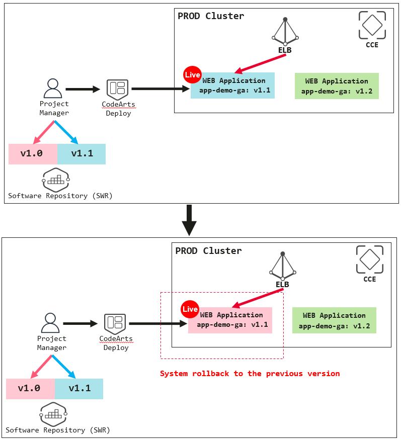

# Huawei CodeArts Challenge

### Version control rollback with the use of image tagging for the production environment

Recall back from the previous exercise that we have configured the blue deployment in the production environment where this deployment having a history version of a web application image being stored in the SWR service **(red color webpage with image version tagged as 1.0)**. Assume that for the current version of the web application **(blue color webpage with image version tagged as 1.1)** having some webpage failure and you would like to rollback to the history red version of the web application. Try to explore the CodeArts Deploy service feature to achieve such rollback.

*
  
*
*
 Figure 8.0: Application version control rollback for the production environment
*

**Good Luck!**