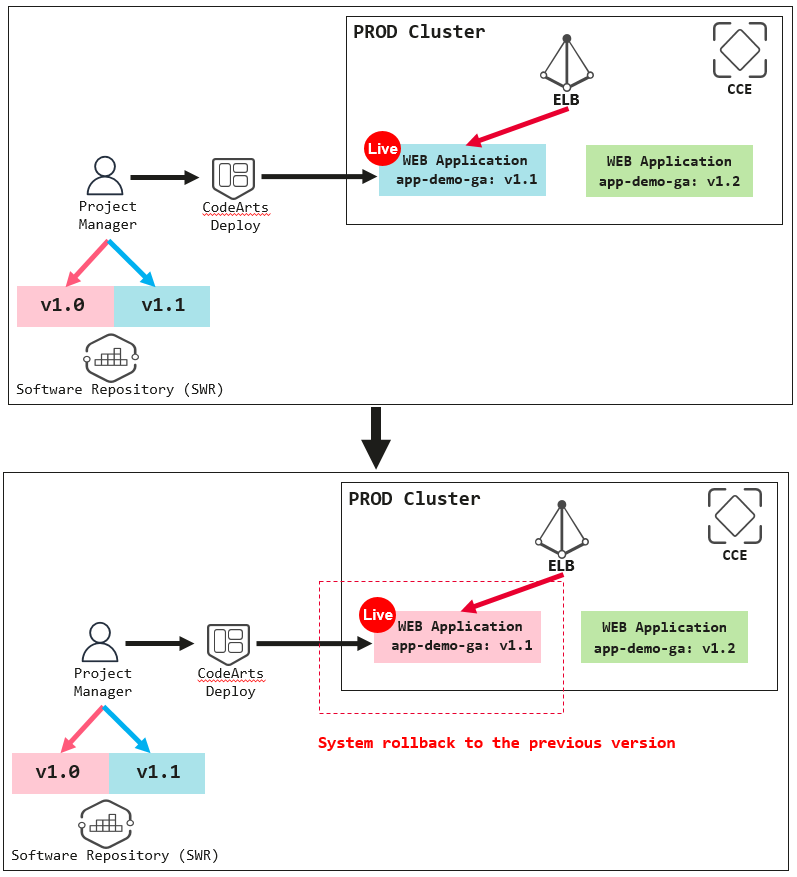
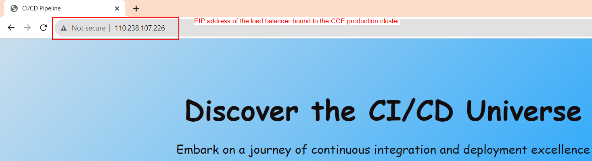
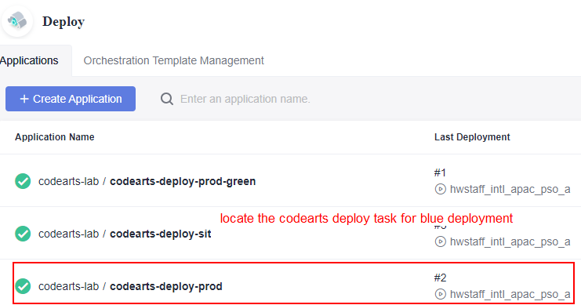
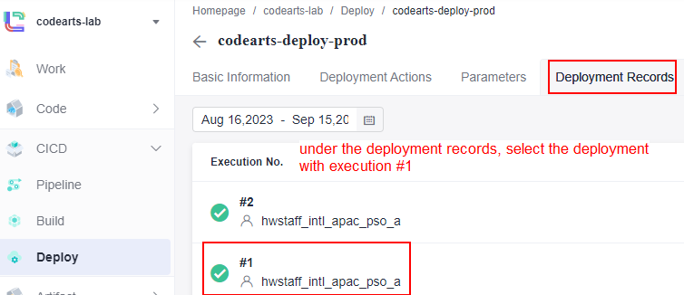
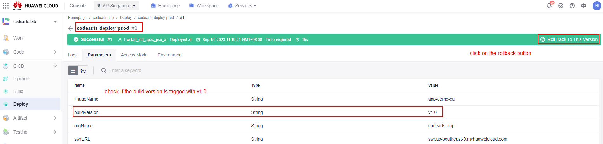
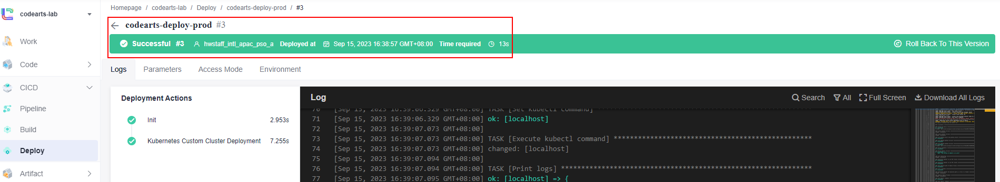
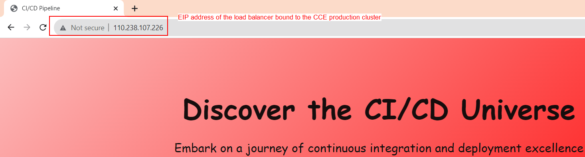

# Version control rollback with the use of image tagging for the production environment

Recall back from the previous exercise that we have configured the blue deployment in the production environment where this deployment having a history version of a web application image being stored in SWR service **(red color webpage with image version tagged as 1.0)**. To simulate the version control rollback in the production environment, we need to patch the service back to the blue deployment from the previous execise **(load balancer is pointing to the green deployment at this moment)**. After that, we can simulate the scenario of version rollback of the web application from **version v1.1 (blue color background) to v1.0 (red color background)** as shown in Figure 8.0. 

*<p align="center">  </p>*
*<p align="center"> Figure 8.0: Application version control rollback for the production environment</p>*

1. First, run the command below to point the ELB to the blue deployment. Verofy the traffic has been patched to the blue deployment in production cluster.
    
    ```kubectl -n ns-devops patch service prod-srv -p '{"spec":{"selector":{"app": "php-fpm-nginx"}}}'```

    *<p align="center">  </p>*
    *<p align="center"> Figure 8.1: Load balancer pointed to the blue deployment</p>*

2. Navigate to the **CodeArts Deploy** service and search for the **blue deployment CodeArts Deploy task**. Confirm the **build version number** and click the ```rollback button``` to rollback the version to history red.

    *<p align="center">  </p>*
    *<p align="center"> Figure 8.2: Version rollback from v1.1 to v1.0</p>*
    *<p align="center">  </p>*
    *<p align="center"> Figure 8.3: Version rollback from v1.1 to v1.0</p>*
    *<p align="center">  </p>*
    *<p align="center"> Figure 8.4: Version rollback from v1.1 to v1.0</p>*

3. Verify the web application had rollback to the **history version of the red color** background.

    *<p align="center">  </p>*
    *<p align="center"> Figure 8.5: Version rollback to the history red color web application</p>*
    *<p align="center">  </p>*
    *<p align="center"> Figure 8.6: Version rollback to the history red color web application</p>*

**At this stage, you have completed all the exercises that being designed for this lab!**